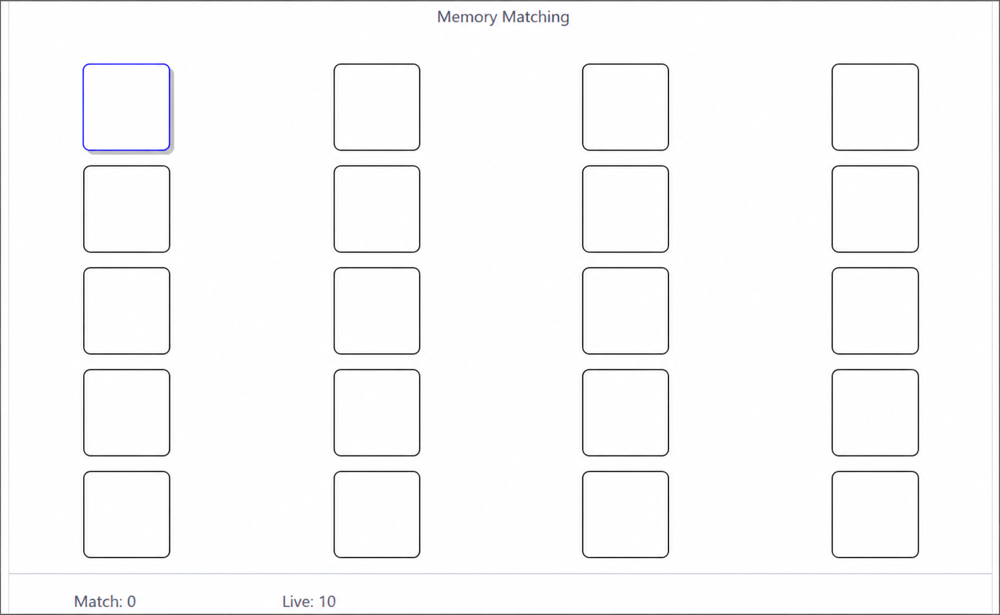
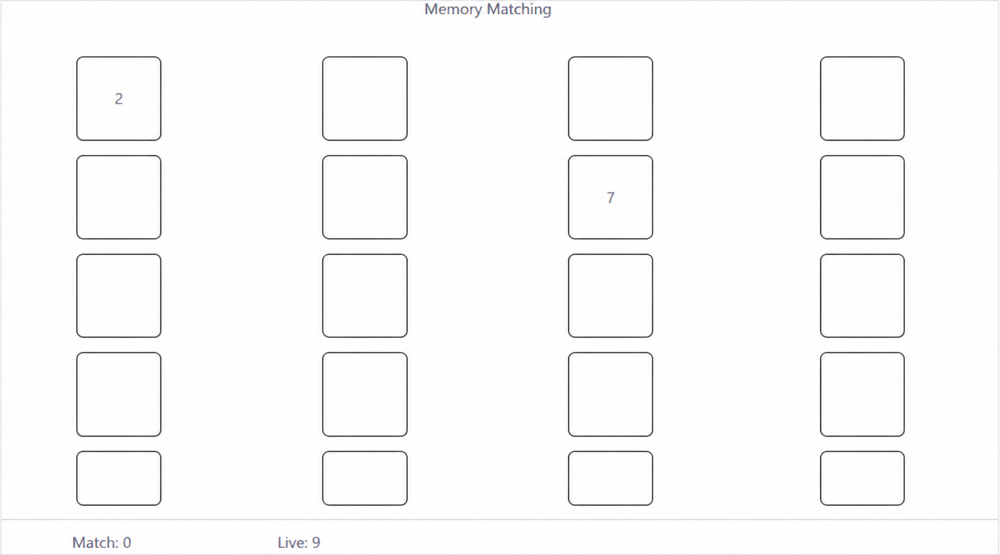
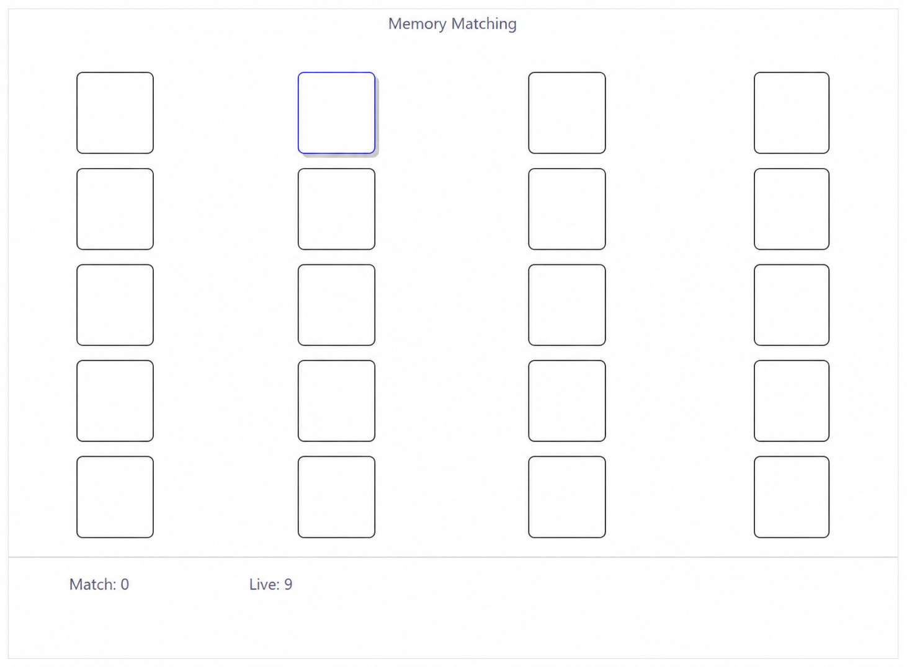
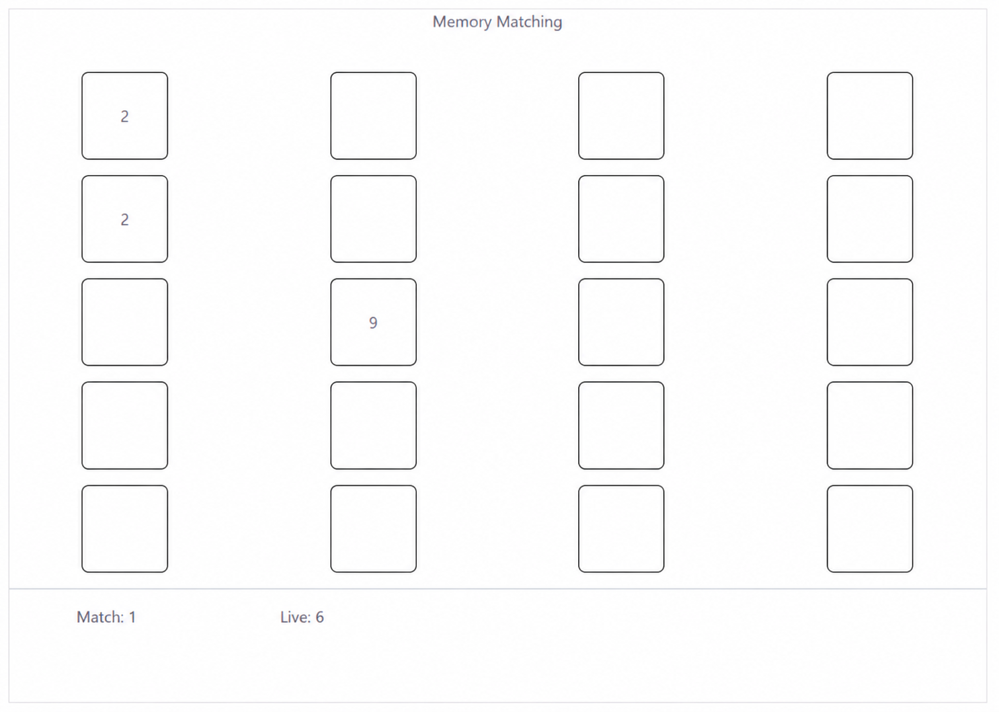
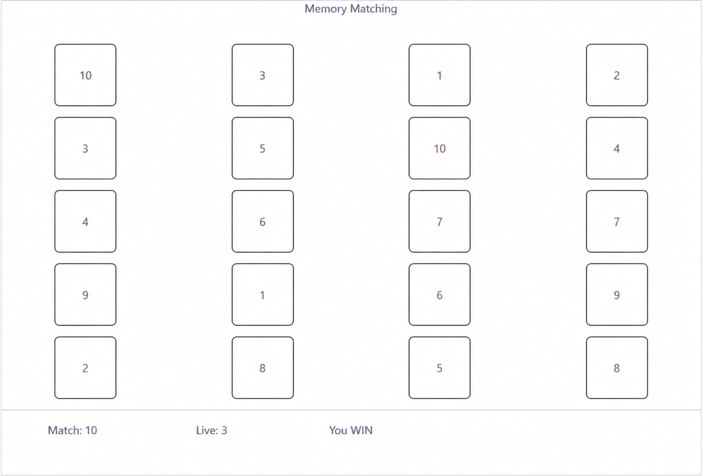

# React - Memory Matching Game

## Submission

- Deploy the built version on Git Hub.
- You can reuse your existing repository.
- If use existing repository, submit the full path to your work.

## Instructions

- Develop a memory matching game with React.
- The game contain 20 cards.
- Each card has a number between 1 to 10.
- There must be 2 cards per number (so totally 20 cards).
- Player may click up to 2 cards at a time.
- When clicked, the card must reveal its associated number.
- If the number of the 2 cards matched, remain the number display and increase "Match" by 1.
- If the number of the 2 cards not matched:
  - Reduce Live by 1.
  - When player click on any other card, hide all the unmatched number.
- If player can match all cards before live reduce to 0, player win, otherwise player lost.

## Hint

- There is no image require to display card, just a blank `div` with specific width and height can mimic card display.
- An easiest way to create the cards is create a constant of 20 cards as array at once with associated number, then shuffle them.
- You may use `useEffect` hook to detect and count how many times user clicked.

## Expected output

The screenshots below are cleaned references from the expected output shown in
Microsoft Teams. They show the required behavior, but the final page design does
not have to copy their styling exactly.

### 1. Initial display

The game starts with 20 hidden cards, `Match: 0`, and `Live: 10`.

### 2. Unmatched pair

When two selected cards do not match, both numbers remain visible for the
moment and `Live` decreases by 1.

### 3. Hide unmatched cards

When the player clicks another card or elsewhere, the previous unmatched cards
are hidden again.

### 4. Matched pair

When two selected cards match, they remain visible and `Match` increases by 1.

### 5. Continue playing

The player can select another hidden card while earlier matched cards remain
visible.

### 6. Winning state

When all ten pairs are matched before `Live` reaches 0, all cards remain
visible and the game displays a winning message.

